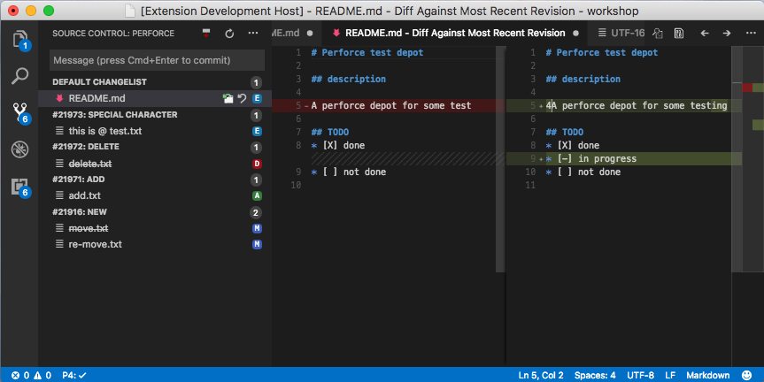

# vscode-perforce

[](https://github.com/stef-levesque/vscode-perforce/issues)
[](https://david-dm.org/stef-levesque/vscode-perforce#info=dependencies)  
[](https://david-dm.org/stef-levesque/vscode-perforce#info=devDependencies)  
[](https://github.com/stef-levesque/vscode-perforce/blob/master/LICENSE.md)
[](https://marketplace.visualstudio.com/items/slevesque.perforce)
[](https://gitter.im/stef-levesque/vscode-perforce)

Perforce integration for Visual Studio Code


## Commands

* `add` - Open a new file to add it to the depot
* `edit` - Open an existing file for edit
* `revert` - Discard changes from an opened file
* `diff` - Display diff of client file with depot file
* `diff revision` - Display diff of client file with depot file at a specific revision
* `info` - Display client/server information
* `login`, `logout` - Login operations

## Configuration

|Name                           |Type       |Description
|-------------------------------|-----------|-----------
|`perforce.client`              |`string`   |Use the specified client
|`perforce.user`                |`string`   |Use the specified user
|`perforce.port`                |`string`   |Use the specified protocol:host:port
|`perforce.password`            |`string`   |Use the specified password
|&nbsp;
|`perforce.editOnFileSave`      |`boolean`  |Automatically open a file for edit when saved
|`perforce.editOnFileModified`  |`boolean`  |Automatically open a file for edit when Modified
|`perforce.addOnFileCreate`     |`boolean`  |Automatically Add a file to depot when Created
|`perforce.deleteOnFileDelete`  |`boolean`  |Automatically delete a file from depot when deleted
|&nbsp;
|`perforce.dir`                 |`string`   |Overrides any PWD setting (current working directory) and replaces it with the specified directory
|`perforce.command`             |`string`   |Configure a path to p4 or an alternate command if needed
|`perforce.compatibilityMode`   |`string`   |Specify if we should run in compatibility mode, currently support `perforce` and `sourcedepot`
|`perforce.maxBuffer`           |`number`   |Specify the largest amount of data allowed for commands, including file comparison. Default is 1048576 (1MB)
|`perforce.realpath`            |`boolean`  |**Experimental** Try to resolve real file path before executing command
|&nbsp;
|`perforce.activationMode`      |`string`   |Controls when to activate the extension (`always`,`autodetect`,`off`)
|`perforce.countBadge`          |`string`   |Controls the badge counter for Perforce (`all`,`off`)
|`perforce.annotate.enable`     |`boolean`  |Show annotation for every file
|`perforce.annotate.changelist` |`boolean`  |Output changelist numbers rather than revision numbers for each line
|`perforce.annotate.user`       |`boolean`  |Output the user who modified the line in the file and the date it was modified
|`perforce.changelistOrder`     |`string`   |Specifies the direction of the chnagelist sorting (`descending`,`ascending`)
|`perforce.scmFileChanges`      |`boolean`  |Open file changes when selected in SCM Explorer


## Activation

You can specify how you want the extension to activate by setting the parameter `perforce.activationMode`

* `always` - Always try to activate the extension (old behavior)
* `autodetect` - Only activate when detecting a valid depot or `.p4config` file (default)
* `off` - Don't try to activate

The following can be set in VSCode user or workspace settings to properly detect the perforce depot
```json
{
    "perforce.user": "your_user",
    "perforce.client": "your_client",
    "perforce.port": "example.com:1666"
}
```

You can also create a `.p4config` file at the root of your workspace with perforce variables
```
P4USER=your_user
P4CLIENT=your_client
P4PORT=example.com:1666
```
More detail in [Perforce Documentation](https://www.perforce.com/perforce/r17.1/manuals/cmdref/index.html#CmdRef/P4CONFIG.html?Highlight=p4config)

## Multi-root support

You can now specify the following settings per workspace:
* `perforce.client`
* `perforce.user`
* `perforce.port`
* `perforce.password`
* `perforce.dir`

This allows you to work with different repository within the same editor.
See [Multi-root Workspaces - Settings](https://code.visualstudio.com/docs/editor/multi-root-workspaces#_settings) for more details.

## Status bar icons

*  opened in add or edit
*  not opened on this client
*  not under client's root

## Source Control in VS Code

  

Visual Studio Code now allow to choose which [Source Control Manager](https://code.visualstudio.com/docs/extensionAPI/api-scm) to use.  
* You can find `Switch SCM Provider` in the command palette, or in the Source Control section menu
* Use the input box to create new changelists
* Right-click on file and changelist for more commands

  
Keep in mind this is still in early beta! Explore and leave your comments on [GitHub](https://github.com/stef-levesque/vscode-hexdump/issues)

## Common Questions

#### **Q:** Something is not working
**A:** Here are a few steps you should try first:
1. Look at the logs with `Perforce: Show Output`
1. Search the [existing issue on GitHub](https://github.com/stef-levesque/vscode-perforce/issues?utf8=✓&q=is%3Aissue)
1. If you can't find your problem, [create an issue](https://github.com/stef-levesque/vscode-perforce/issues/new), and please include the logs when possible
  
  
#### **Q:** Operations on a large files fail
**A:** Increase `perforce.maxBuffer` in your user settings.  
[more...](https://github.com/stef-levesque/vscode-perforce/issues/116)
  
  
#### **Q:** There is a lot of duplicated changelists showing up in the `Source Control` viewlet
**A:** Please provide your Perforce Output logs in [issue #62](https://github.com/stef-levesque/vscode-perforce/issues/62)
  
  
#### **Q:** I'm using this old thing called *Source Depot*...
**A:** Great :) Try to set the experimental setting `"perforce.compatibilityMode": "sourcedepot"`  
[more...](https://github.com/stef-levesque/vscode-perforce/issues/47)

## Installation

1. Install *Visual Studio Code* (1.19 or higher)
2. Launch *Code*
3. From the command palette `ctrl+shift+p` (Windows, Linux) or `cmd+shift+p` (OS X)
4. Select `Install Extensions`
5. Choose the extension `Perforce for VS Code`
6. Reload *Visual Studio Code*

## Contributing

1. Fork it!
2. Create your feature branch: `git checkout -b my-new-feature`
3. Commit your changes: `git commit -am 'Add some feature'`
4. Push to the branch: `git push origin my-new-feature`
5. Submit a pull request :D

## Requirements

Visual Studio Code v1.19

## Credits

* [Visual Studio Code](https://code.visualstudio.com/)
* [vscode-docs on GitHub](https://github.com/Microsoft/vscode-docs)

## License

[MIT](LICENSE.md)
